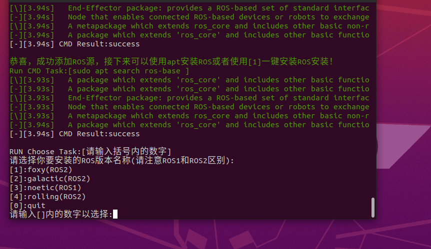
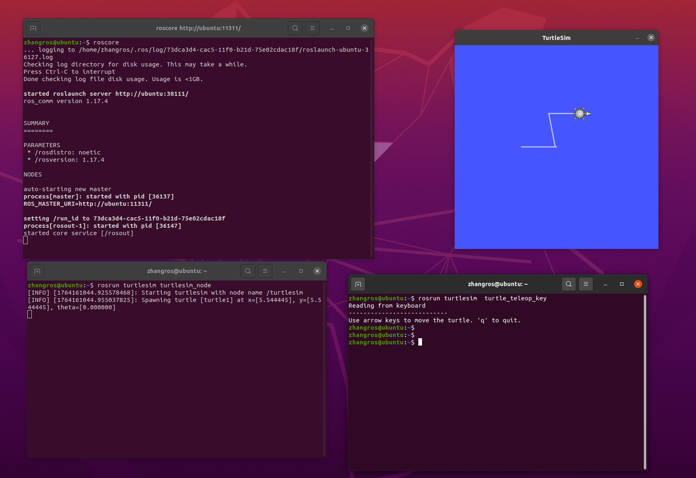

# 安装 ros-noetic
版本 Ubuntu 20.04.6

`$ sudo apt update`

这里直接采用了鱼香提供的安装工具进行安装（新手推荐）  

`$ wget http://fishros.com/install -O fishros && bash fishros`  
 

ROS相关:  
[1]:一键安装(推荐):ROS(支持ROS/ROS2,树莓派Jetson)  
[4]:一键配置:ROS环境(快速更新ROS环境设置,自动生成环境选择)  
[3]:一键安装:rosdep(小鱼的rosdepc,又快又好用)  
[9]:一键安装:Cartographer(内测版易失败)  
[11]:一键安装:ROS Docker版(支持所有版本ROS/ROS2)  
这里输入1后回车  

新手或首次安装一定要一定要一定要换源并清理三方源，换源!!!系统默认国外源容易失败!!  

[1]:更换系统源再继续安装  
[2]:不更换继续安装  
[0]:quit  
请输入[]内的数字以选择:1  
请选择换源方式,如果不知道选什么请选2  
[1]:仅更换系统源  
[2]:更换系统源并清理第三方源  
[0]:quit  
请输入[]内的数字以选择:2  

接下来就根据引导选择noetic/桌面版即可  

  

  

安装成功后验证：  

1.打开第一个终端窗口，运行roscore  

`roscore`  

2.打开第二个终端窗口  

`rosrun turtlesim turtlesim_node`  

3.打开第三个终端窗口，输入：  

`rosrun turtlesim  turtle_teleop_key`  

鼠标指针放在第三个窗口里,便可以通过按下 ↑ ↓ ← →键来对小海龟进行控制了  

  

